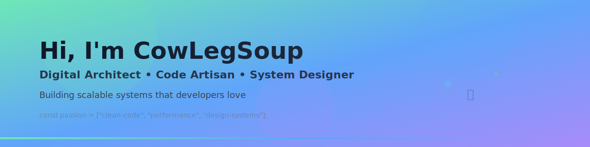

---

### 
👨‍💻 About Me

I'm a **Digital Architect** and **Code Artisan** with a passion for building elegant, high-performance systems. My focus is on creating software that is not only powerful and scalable but also a joy for other developers to work with. I believe in the power of clean code, thoughtful design, and a strong open-source community.

<table>
  <tr>
    <td valign="top" width="50%">
      
**My Guiding Principles** 💡

<b>Clean & Scalable Architecture</b>

 
I design systems with a long-term vision, emphasizing modularity, separation of concerns, and clear APIs. The goal is to build a foundation that can gracefully evolve with changing requirements.

<b>Performance by Default</b>

 
Latency is the ultimate bug. I obsess over efficient algorithms, smart caching strategies, and optimized data flows to ensure a snappy and responsive user experience, even at scale.

<b>Developer Experience (DX) First</b>

 
The best tools and systems are those that empower developers. I am dedicated to creating comprehensive documentation, automated workflows, and intuitive design systems that reduce friction and accelerate innovation.

    </td>
    <td valign="top" width="50%">

*Currently exploring the frontiers of distributed systems, WebAssembly, and Rust for high-concurrency applications.*

    </td>
  </tr>
</table>

---

### 
🛠️ My Digital Toolbox

My toolkit is constantly evolving. Here are the technologies I'm most proficient with right now:

<table width="100%">
  <tr>
    <td width="33%" valign="top">
      
<b>Languages</b>

      

        
        
        
        
      

    </td>
    <td width="33%" valign="top">
      
<b>Frontend & Backend</b>

      

        
        
        
      

    </td>
    <td width="33%" valign="top">
      
<b>Infrastructure & Data</b>

      

        
        
        
        
        
      

    </td>
  </tr>
</table>

---

### 
🚀 Featured Work

Here are some of the projects I'm passionate about. They are pinned to my profile for you to explore!

*(This section intentionally left simple to let my pinned repositories speak for themselves.)*

---

### 
📊 My GitHub Vitals

  
  
   
  

  

---

### 
🌐 Let's Connect

I'm always open to collaborating on interesting projects or just chatting about technology.

